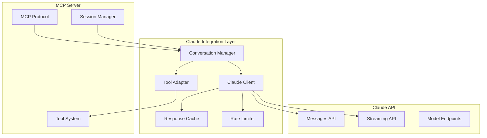

# TelemetryFlow Claude API Integration Specification

## Overview

This specification defines the integration between TelemetryFlow GO MCP Server and Anthropic's Claude API, enabling AI-powered conversations with tool execution capabilities through the MCP protocol.

## Goals

- Seamless integration with Claude API using anthropic-sdk-go v0.2.0-beta.3
- Support for all Claude models (Claude 4, Claude 3.5 series)
- Robust conversation management with multi-turn support
- Efficient tool execution integration with Claude's tool use capabilities
- Comprehensive error handling and retry mechanisms
- Performance optimization with caching and rate limiting

## Architecture

### Claude Integration Components



## Domain Model

### Claude Client Configuration

```go
type ClaudeClient struct {
    client      *anthropic.Client
    config      *ClaudeConfig
    rateLimiter *RateLimiter
    cache       IResponseCache
    metrics     *ClaudeMetrics
    logger      *Logger
}

type ClaudeConfig struct {
    APIKey      string        `yaml:"api_key" env:"ANTHROPIC_API_KEY"`
    BaseURL     string        `yaml:"base_url" env:"ANTHROPIC_BASE_URL"`
    Timeout     time.Duration `yaml:"timeout" env:"ANTHROPIC_TIMEOUT"`
    MaxRetries  int           `yaml:"max_retries" env:"ANTHROPIC_MAX_RETRIES"`
    RateLimit   RateLimit     `yaml:"rate_limit"`
    Cache       CacheConfig   `yaml:"cache"`
    Models      ModelConfig   `yaml:"models"`
}

type RateLimit struct {
    RequestsPerMinute int `yaml:"requests_per_minute"`
    TokensPerMinute   int `yaml:"tokens_per_minute"`
    BurstSize         int `yaml:"burst_size"`
}

type CacheConfig struct {
    Enabled    bool          `yaml:"enabled"`
    TTL        time.Duration `yaml:"ttl"`
    MaxSize    int           `yaml:"max_size"`
    KeyPrefix  string        `yaml:"key_prefix"`
}
```

### Conversation Management

```go
type ConversationManager struct {
    claudeClient *ClaudeClient
    toolAdapter  *ToolAdapter
    sessionRepo  repositories.ISessionRepository
    convRepo     repositories.IConversationRepository
    logger       *Logger
    metrics      *ConversationMetrics
}

type Conversation struct {
    id        vo.ConversationID
    sessionID vo.SessionID
    messages  []*entities.Message
    context   ConversationContext
    state     ConversationState
    model     ClaudeModel
    config    ConversationConfig
    createdAt time.Time
    updatedAt time.Time
}

type ConversationContext struct {
    SystemPrompt    string                 `json:"system_prompt"`
    MaxTokens       int                    `json:"max_tokens"`
    Temperature     float64                `json:"temperature"`
    TopP            float64                `json:"top_p"`
    TopK            int                    `json:"top_k"`
    StopSequences   []string               `json:"stop_sequences"`
    Metadata        map[string]interface{} `json:"metadata"`
}

type ConversationState string

const (
    ConversationStateActive    ConversationState = "active"
    ConversationStatePaused    ConversationState = "paused"
    ConversationStateClosed    ConversationState = "closed"
    ConversationStateError     ConversationState = "error"
)
```

### Claude Models

```go
type ClaudeModel string

const (
    // Claude 4 Models (latest)
    Claude4Opus   ClaudeModel = "claude-4-opus-20241022"
    Claude4Sonnet ClaudeModel = "claude-4-sonnet-20241022"

    // Claude 3.5 Models
    Claude35Sonnet ClaudeModel = "claude-3-5-sonnet-20241022"
    Claude35Haiku  ClaudeModel = "claude-3-5-haiku-20241022"

    // Default model for MCP operations
    DefaultModel = Claude35Sonnet
)

type ModelCapabilities struct {
    MaxTokens         int     `json:"max_tokens"`
    MaxInputTokens    int     `json:"max_input_tokens"`
    MaxOutputTokens   int     `json:"max_output_tokens"`
    SupportsVision    bool    `json:"supports_vision"`
    SupportsTools     bool    `json:"supports_tools"`
    SupportsStreaming bool    `json:"supports_streaming"`
    CostPerInputToken float64 `json:"cost_per_input_token"`
    CostPerOutputToken float64 `json:"cost_per_output_token"`
}

var ModelCapabilitiesMap = map[ClaudeModel]ModelCapabilities{
    Claude4Opus: {
        MaxTokens:         200000,
        MaxInputTokens:    200000,
        MaxOutputTokens:   4096,
        SupportsVision:    true,
        SupportsTools:     true,
        SupportsStreaming: true,
        CostPerInputToken: 0.000015,
        CostPerOutputToken: 0.000075,
    },
    Claude35Sonnet: {
        MaxTokens:         200000,
        MaxInputTokens:    200000,
        MaxOutputTokens:   8192,
        SupportsVision:    true,
        SupportsTools:     true,
        SupportsStreaming: true,
        CostPerInputToken: 0.000003,
        CostPerOutputToken: 0.000015,
    },
    // ... other models
}
```

## Implementation Requirements

### 1. Claude Client Implementation

#### Basic Message Handling

```go
func (c *ClaudeClient) SendMessage(ctx context.Context, req *MessageRequest) (*MessageResponse, error) {
    // Start tracing
    ctx, span := StartMCPSpan(ctx, "claude.message.send",
        attribute.String("claude.model", string(req.Model)),
        attribute.Int("claude.message.count", len(req.Messages)),
        attribute.Int("claude.max_tokens", req.MaxTokens),
    )
    defer span.End()

    // Validate request
    if err := c.validateRequest(req); err != nil {
        span.RecordError(err)
        return nil, fmt.Errorf("invalid request: %w", err)
    }

    // Check rate limits
    if err := c.rateLimiter.Wait(ctx); err != nil {
        span.RecordError(err)
        return nil, fmt.Errorf("rate limit exceeded: %w", err)
    }

    // Check cache
    if c.cache != nil {
        if cached, found := c.cache.Get(ctx, c.buildCacheKey(req)); found {
            span.AddEvent("cache.hit")
            c.metrics.CacheHits.Inc()
            return cached.(*MessageResponse), nil
        }
        span.AddEvent("cache.miss")
        c.metrics.CacheMisses.Inc()
    }

    // Execute with retry
    response, err := c.executeWithRetry(ctx, func() (*MessageResponse, error) {
        return c.sendMessageInternal(ctx, req)
    })

    if err != nil {
        span.RecordError(err)
        c.metrics.RequestErrors.WithLabelValues(string(req.Model), "error").Inc()
        return nil, err
    }

    // Cache response
    if c.cache != nil && c.shouldCache(req, response) {
        c.cache.Set(ctx, c.buildCacheKey(req), response, c.config.Cache.TTL)
    }

    // Record metrics
    c.metrics.RequestsTotal.WithLabelValues(string(req.Model), "success").Inc()
    if response.Usage != nil {
        c.metrics.TokensUsed.WithLabelValues(string(req.Model), "input").Add(float64(response.Usage.InputTokens))
        c.metrics.TokensUsed.WithLabelValues(string(req.Model), "output").Add(float64(response.Usage.OutputTokens))
    }

    return response, nil
}

func (c *ClaudeClient) sendMessageInternal(ctx context.Context, req *MessageRequest) (*MessageResponse, error) {
    // Convert to Anthropic format
    anthropicReq := c.convertToAnthropicRequest(req)

    // Send request
    start := time.Now()
    resp, err := c.client.Messages.New(ctx, anthropicReq)
    duration := time.Since(start)

    // Record duration
    c.metrics.RequestDuration.WithLabelValues(string(req.Model)).Observe(duration.Seconds())

    if err != nil {
        return nil, c.convertAnthropicError(err)
    }

    // Convert response
    return c.convertFromAnthropicResponse(resp), nil
}
```

#### Streaming Support

```go
type StreamingHandler struct {
    OnStart    func()
    OnContent  func(content string)
    OnToolUse  func(toolUse ToolUse)
    OnComplete func(response *MessageResponse)
    OnError    func(error)
}

func (c *ClaudeClient) StreamMessage(ctx context.Context, req *MessageRequest, handler *StreamingHandler) error {
    ctx, span := StartMCPSpan(ctx, "claude.message.stream",
        attribute.String("claude.model", string(req.Model)),
    )
    defer span.End()

    // Validate streaming support
    capabilities := ModelCapabilitiesMap[req.Model]
    if !capabilities.SupportsStreaming {
        err := ErrStreamingNotSupported
        span.RecordError(err)
        return err
    }

    // Check rate limits
    if err := c.rateLimiter.Wait(ctx); err != nil {
        span.RecordError(err)
        return err
    }

    // Convert request
    anthropicReq := c.convertToAnthropicRequest(req)
    anthropicReq.Stream = anthropic.F(true)

    // Start streaming
    if handler.OnStart != nil {
        handler.OnStart()
    }

    stream, err := c.client.Messages.NewStreaming(ctx, anthropicReq)
    if err != nil {
        span.RecordError(err)
        if handler.OnError != nil {
            handler.OnError(c.convertAnthropicError(err))
        }
        return err
    }

    // Process stream
    var response MessageResponse
    var currentContent strings.Builder

    for stream.Next() {
        event := stream.Current()

        switch event.Type {
        case "message_start":
            response.ID = event.Message.ID
            response.Model = ClaudeModel(event.Message.Model)
            response.Role = event.Message.Role

        case "content_block_start":
            if event.ContentBlock.Type == "text" {
                // Text content block started
            } else if event.ContentBlock.Type == "tool_use" {
                // Tool use block started
                if handler.OnToolUse != nil {
                    toolUse := ToolUse{
                        ID:    event.ContentBlock.ID,
                        Name:  event.ContentBlock.Name,
                        Input: event.ContentBlock.Input,
                    }
                    handler.OnToolUse(toolUse)
                }
            }

        case "content_block_delta":
            if event.Delta.Type == "text_delta" {
                currentContent.WriteString(event.Delta.Text)
                if handler.OnContent != nil {
                    handler.OnContent(event.Delta.Text)
                }
            }

        case "content_block_stop":
            // Content block completed

        case "message_delta":
            if event.Delta.StopReason != "" {
                response.StopReason = event.Delta.StopReason
            }

        case "message_stop":
            response.Content = []ContentBlock{{
                Type: "text",
                Text: currentContent.String(),
            }}

            if handler.OnComplete != nil {
                handler.OnComplete(&response)
            }
        }
    }

    if err := stream.Err(); err != nil {
        span.RecordError(err)
        if handler.OnError != nil {
            handler.OnError(c.convertAnthropicError(err))
        }
        return err
    }

    return nil
}
```

### 2. Tool Integration

#### Tool Adapter

```go
type ToolAdapter struct {
    toolRegistry IToolRegistry
    executor     IToolExecutor
    logger       *Logger
    metrics      *ToolMetrics
}

func (ta *ToolAdapter) ConvertMCPToolsToClaudeTools(ctx context.Context, sessionID vo.SessionID) ([]ClaudeTool, error) {
    // Get available tools for session
    tools, err := ta.toolRegistry.List(ctx, ToolFilter{
        EnabledOnly: true,
        SessionID:   sessionID,
    })
    if err != nil {
        return nil, fmt.Errorf("failed to list tools: %w", err)
    }

    var claudeTools []ClaudeTool
    for _, tool := range tools {
        claudeTool := ClaudeTool{
            Name:        tool.Name().String(),
            Description: tool.Description(),
            InputSchema: tool.InputSchema(),
        }
        claudeTools = append(claudeTools, claudeTool)
    }

    return claudeTools, nil
}

func (ta *ToolAdapter) ExecuteToolUse(ctx context.Context, execCtx *ToolExecutionContext, toolUse ToolUse) (*ToolResult, error) {
    ctx, span := StartMCPSpan(ctx, "tool.execute_from_claude",
        attribute.String("tool.name", toolUse.Name),
        attribute.String("tool.use.id", toolUse.ID),
    )
    defer span.End()

    // Execute tool
    result, err := ta.executor.ExecuteTool(ctx, &ToolExecutionContext{
        SessionID:      execCtx.SessionID,
        ConversationID: execCtx.ConversationID,
        ToolName:       vo.ToolName(toolUse.Name),
        Input:          toolUse.Input,
        RequestID:      execCtx.RequestID,
        UserContext:    execCtx.UserContext,
        Permissions:    execCtx.Permissions,
        Timeout:        execCtx.Timeout,
    })

    if err != nil {
        span.RecordError(err)
        return &ToolResult{
            ToolUseID: toolUse.ID,
            Content:   fmt.Sprintf("Tool execution failed: %s", err.Error()),
            IsError:   true,
        }, nil
    }

    // Convert result to Claude format
    var content string
    if len(result.Content) > 0 {
        content = result.Content[0].Text
    }

    return &ToolResult{
        ToolUseID: toolUse.ID,
        Content:   content,
        IsError:   result.IsError,
    }, nil
}
```

#### Tool Use Processing

```go
func (cm *ConversationManager) ProcessToolUses(ctx context.Context, conversation *Conversation, toolUses []ToolUse) ([]*entities.Message, error) {
    var toolResults []*entities.Message

    // Execute tools in parallel (with concurrency limit)
    semaphore := make(chan struct{}, 5) // Max 5 concurrent tool executions
    var wg sync.WaitGroup
    var mu sync.Mutex
    var errors []error

    for _, toolUse := range toolUses {
        wg.Add(1)
        go func(tu ToolUse) {
            defer wg.Done()

            semaphore <- struct{}{} // Acquire
            defer func() { <-semaphore }() // Release

            execCtx := &ToolExecutionContext{
                SessionID:      conversation.SessionID,
                ConversationID: conversation.ID,
                RequestID:      uuid.New().String(),
                Timeout:        30 * time.Second,
            }

            result, err := cm.toolAdapter.ExecuteToolUse(ctx, execCtx, tu)

            mu.Lock()
            defer mu.Unlock()

            if err != nil {
                errors = append(errors, err)
                return
            }

            // Create tool result message
            message := entities.NewMessage(
                vo.MessageID(uuid.New().String()),
                "user", // Tool results are sent as user messages
                []ContentBlock{{
                    Type:      "tool_result",
                    ToolUseID: result.ToolUseID,
                    Content:   result.Content,
                    IsError:   result.IsError,
                }},
                time.Now(),
            )

            toolResults = append(toolResults, message)
        }(toolUse)
    }

    wg.Wait()

    if len(errors) > 0 {
        return nil, fmt.Errorf("tool execution errors: %v", errors)
    }

    return toolResults, nil
}
```

### 3. Conversation Management

#### Multi-turn Conversations

```go
func (cm *ConversationManager) ContinueConversation(ctx context.Context, req *ContinueConversationRequest) (*ConversationResponse, error) {
    ctx, span := StartMCPSpan(ctx, "conversation.continue",
        attribute.String("conversation.id", req.ConversationID.String()),
    )
    defer span.End()

    // Load conversation
    conversation, err := cm.convRepo.FindByID(ctx, req.ConversationID)
    if err != nil {
        span.RecordError(err)
        return nil, fmt.Errorf("conversation not found: %w", err)
    }

    // Add user message
    userMessage := entities.NewMessage(
        vo.MessageID(uuid.New().String()),
        "user",
        []ContentBlock{{Type: "text", Text: req.Message}},
        time.Now(),
    )

    conversation.AddMessage(userMessage)

    // Build message history for Claude
    messages := cm.buildClaudeMessages(conversation)

    // Get available tools
    tools, err := cm.toolAdapter.ConvertMCPToolsToClaudeTools(ctx, conversation.SessionID)
    if err != nil {
        span.RecordError(err)
        return nil, fmt.Errorf("failed to get tools: %w", err)
    }

    // Send to Claude
    claudeReq := &MessageRequest{
        Model:     conversation.Model,
        Messages:  messages,
        MaxTokens: conversation.Context.MaxTokens,
        Tools:     tools,
        System:    conversation.Context.SystemPrompt,
    }

    response, err := cm.claudeClient.SendMessage(ctx, claudeReq)
    if err != nil {
        span.RecordError(err)
        return nil, fmt.Errorf("claude request failed: %w", err)
    }

    // Process tool uses if any
    var toolUses []ToolUse
    for _, content := range response.Content {
        if content.Type == "tool_use" {
            toolUses = append(toolUses, ToolUse{
                ID:    content.ToolUseID,
                Name:  content.Name,
                Input: content.Input,
            })
        }
    }

    // Execute tools if needed
    if len(toolUses) > 0 {
        toolResults, err := cm.ProcessToolUses(ctx, conversation, toolUses)
        if err != nil {
            span.RecordError(err)
            return nil, fmt.Errorf("tool execution failed: %w", err)
        }

        // Add tool results to conversation
        for _, result := range toolResults {
            conversation.AddMessage(result)
        }

        // Send tool results back to Claude
        messages = cm.buildClaudeMessages(conversation)
        claudeReq.Messages = messages

        response, err = cm.claudeClient.SendMessage(ctx, claudeReq)
        if err != nil {
            span.RecordError(err)
            return nil, fmt.Errorf("claude follow-up request failed: %w", err)
        }
    }

    // Add Claude's response to conversation
    assistantMessage := entities.NewMessage(
        vo.MessageID(uuid.New().String()),
        "assistant",
        response.Content,
        time.Now(),
    )

    conversation.AddMessage(assistantMessage)

    // Save conversation
    if err := cm.convRepo.Save(ctx, conversation); err != nil {
        span.RecordError(err)
        return nil, fmt.Errorf("failed to save conversation: %w", err)
    }

    // Build response
    var responseText string
    for _, content := range response.Content {
        if content.Type == "text" {
            responseText += content.Text
        }
    }

    return &ConversationResponse{
        ConversationID: conversation.ID,
        Response:       responseText,
        ToolsUsed:      len(toolUses) > 0,
        ToolCalls:      extractToolNames(toolUses),
        TokenUsage:     response.Usage,
    }, nil
}
```

### 4. Error Handling and Retry Logic

#### Retry Configuration

```go
type RetryConfig struct {
    MaxRetries      int           `yaml:"max_retries"`
    InitialDelay    time.Duration `yaml:"initial_delay"`
    MaxDelay        time.Duration `yaml:"max_delay"`
    BackoffFactor   float64       `yaml:"backoff_factor"`
    RetryableErrors []string      `yaml:"retryable_errors"`
}

func (c *ClaudeClient) executeWithRetry(ctx context.Context, operation func() (*MessageResponse, error)) (*MessageResponse, error) {
    var lastErr error

    for attempt := 0; attempt <= c.config.MaxRetries; attempt++ {
        if attempt > 0 {
            delay := time.Duration(float64(c.config.InitialDelay) *
                math.Pow(c.config.BackoffFactor, float64(attempt-1)))
            if delay > c.config.MaxDelay {
                delay = c.config.MaxDelay
            }

            select {
            case <-ctx.Done():
                return nil, ctx.Err()
            case <-time.After(delay):
            }

            c.logger.Warn().
                Int("attempt", attempt).
                Dur("delay", delay).
                Err(lastErr).
                Msg("Retrying Claude API request")
        }

        response, err := operation()
        if err != nil {
            lastErr = err
            if !c.isRetryableError(err) {
                return nil, err
            }
            continue
        }

        return response, nil
    }

    return nil, fmt.Errorf("operation failed after %d attempts: %w",
        c.config.MaxRetries, lastErr)
}

func (c *ClaudeClient) isRetryableError(err error) bool {
    // Check for specific error types that should be retried
    var anthropicErr *anthropic.Error
    if errors.As(err, &anthropicErr) {
        switch anthropicErr.Type {
        case "rate_limit_error":
            return true
        case "overloaded_error":
            return true
        case "api_error":
            return true
        default:
            return false
        }
    }

    // Check for network errors
    if isNetworkError(err) {
        return true
    }

    return false
}
```

#### Error Conversion

```go
func (c *ClaudeClient) convertAnthropicError(err error) error {
    var anthropicErr *anthropic.Error
    if !errors.As(err, &anthropicErr) {
        return err
    }

    switch anthropicErr.Type {
    case "invalid_request_error":
        return &ClaudeError{
            Type:    "invalid_request",
            Message: anthropicErr.Message,
            Code:    400,
        }
    case "authentication_error":
        return &ClaudeError{
            Type:    "authentication_failed",
            Message: "Invalid API key",
            Code:    401,
        }
    case "permission_error":
        return &ClaudeError{
            Type:    "permission_denied",
            Message: anthropicErr.Message,
            Code:    403,
        }
    case "not_found_error":
        return &ClaudeError{
            Type:    "not_found",
            Message: anthropicErr.Message,
            Code:    404,
        }
    case "rate_limit_error":
        return &ClaudeError{
            Type:    "rate_limit_exceeded",
            Message: "Rate limit exceeded",
            Code:    429,
        }
    case "api_error":
        return &ClaudeError{
            Type:    "api_error",
            Message: anthropicErr.Message,
            Code:    500,
        }
    case "overloaded_error":
        return &ClaudeError{
            Type:    "service_overloaded",
            Message: "Service temporarily overloaded",
            Code:    503,
        }
    default:
        return &ClaudeError{
            Type:    "unknown_error",
            Message: anthropicErr.Message,
            Code:    500,
        }
    }
}
```

### 5. Performance Optimization

#### Response Caching

```go
type ResponseCache struct {
    cache   map[string]*CacheEntry
    mutex   sync.RWMutex
    maxSize int
    ttl     time.Duration
}

type CacheEntry struct {
    Response  *MessageResponse
    CreatedAt time.Time
    AccessCount int
}

func (rc *ResponseCache) Get(ctx context.Context, key string) (*MessageResponse, bool) {
    rc.mutex.RLock()
    defer rc.mutex.RUnlock()

    entry, exists := rc.cache[key]
    if !exists {
        return nil, false
    }

    // Check TTL
    if time.Since(entry.CreatedAt) > rc.ttl {
        delete(rc.cache, key)
        return nil, false
    }

    entry.AccessCount++
    return entry.Response, true
}

func (rc *ResponseCache) Set(ctx context.Context, key string, response *MessageResponse, ttl time.Duration) {
    rc.mutex.Lock()
    defer rc.mutex.Unlock()

    // Evict if at capacity
    if len(rc.cache) >= rc.maxSize {
        rc.evictLRU()
    }

    rc.cache[key] = &CacheEntry{
        Response:  response,
        CreatedAt: time.Now(),
        AccessCount: 1,
    }
}

func (rc *ResponseCache) buildCacheKey(req *MessageRequest) string {
    // Build deterministic cache key from request
    h := sha256.New()
    h.Write([]byte(string(req.Model)))
    h.Write([]byte(req.System))

    for _, msg := range req.Messages {
        h.Write([]byte(msg.Role))
        for _, content := range msg.Content {
            h.Write([]byte(content.Text))
        }
    }

    return hex.EncodeToString(h.Sum(nil))
}
```

#### Rate Limiting

```go
type RateLimiter struct {
    requestLimiter *rate.Limiter
    tokenLimiter   *rate.Limiter
    burstSize      int
    logger         *Logger
}

func NewRateLimiter(config RateLimit) *RateLimiter {
    return &RateLimiter{
        requestLimiter: rate.NewLimiter(rate.Every(time.Minute/time.Duration(config.RequestsPerMinute)), config.BurstSize),
        tokenLimiter:   rate.NewLimiter(rate.Every(time.Minute/time.Duration(config.TokensPerMinute)), config.TokensPerMinute),
        burstSize:      config.BurstSize,
    }
}

func (rl *RateLimiter) Wait(ctx context.Context) error {
    // Wait for request rate limit
    if err := rl.requestLimiter.Wait(ctx); err != nil {
        return fmt.Errorf("request rate limit: %w", err)
    }

    return nil
}

func (rl *RateLimiter) WaitForTokens(ctx context.Context, tokens int) error {
    // Reserve tokens
    reservation := rl.tokenLimiter.ReserveN(time.Now(), tokens)
    if !reservation.OK() {
        return ErrTokenRateLimitExceeded
    }

    // Wait for reservation
    delay := reservation.Delay()
    if delay > 0 {
        select {
        case <-ctx.Done():
            reservation.Cancel()
            return ctx.Err()
        case <-time.After(delay):
        }
    }

    return nil
}
```

## Configuration

### Claude Integration Configuration

```yaml
claude:
  api_key: "${ANTHROPIC_API_KEY}"
  base_url: "https://api.anthropic.com"
  timeout: "30s"
  max_retries: 3

  rate_limit:
    requests_per_minute: 60
    tokens_per_minute: 100000
    burst_size: 10

  cache:
    enabled: true
    ttl: "5m"
    max_size: 1000
    key_prefix: "claude_cache:"

  models:
    default: "claude-3-5-sonnet-20241022"
    available:
      - "claude-4-opus-20241022"
      - "claude-4-sonnet-20241022"
      - "claude-3-5-sonnet-20241022"
      - "claude-3-5-haiku-20241022"

  retry:
    initial_delay: "1s"
    max_delay: "30s"
    backoff_factor: 2.0
    retryable_errors:
      - "rate_limit_error"
      - "overloaded_error"
      - "api_error"

conversations:
  max_history: 50
  default_max_tokens: 4096
  default_temperature: 0.7
  system_prompt: |
    You are Claude, an AI assistant created by Anthropic. You have access to various tools
    that can help you assist users with their tasks. Use tools when appropriate to provide
    accurate and helpful responses.
```

## Testing Requirements

### Claude Integration Tests

```go
func TestClaudeIntegration(t *testing.T) {
    if testing.Short() {
        t.Skip("Skipping Claude integration test in short mode")
    }

    apiKey := os.Getenv("ANTHROPIC_API_KEY")
    if apiKey == "" {
        t.Skip("ANTHROPIC_API_KEY not set")
    }

    client := NewClaudeClient(&ClaudeConfig{
        APIKey:  apiKey,
        Timeout: 30 * time.Second,
    })

    tests := []struct {
        name     string
        request  *MessageRequest
        wantErr  bool
        validate func(*testing.T, *MessageResponse)
    }{
        {
            name: "simple message",
            request: &MessageRequest{
                Model: Claude35Sonnet,
                Messages: []Message{{
                    Role: "user",
                    Content: []ContentBlock{{
                        Type: "text",
                        Text: "Hello, Claude!",
                    }},
                }},
                MaxTokens: 100,
            },
            wantErr: false,
            validate: func(t *testing.T, resp *MessageResponse) {
                assert.NotEmpty(t, resp.Content)
                assert.NotNil(t, resp.Usage)
                assert.Greater(t, resp.Usage.OutputTokens, 0)
            },
        },
        // ... more test cases
    }

    for _, tt := range tests {
        t.Run(tt.name, func(t *testing.T) {
            ctx, cancel := context.WithTimeout(context.Background(), 30*time.Second)
            defer cancel()

            resp, err := client.SendMessage(ctx, tt.request)

            if tt.wantErr {
                assert.Error(t, err)
            } else {
                assert.NoError(t, err)
                assert.NotNil(t, resp)

                if tt.validate != nil {
                    tt.validate(t, resp)
                }
            }
        })
    }
}
```

## Success Criteria

### Functional Requirements

- [ ] Support for all Claude models with proper capabilities detection
- [ ] Multi-turn conversation management with context preservation
- [ ] Tool execution integration with Claude's tool use capabilities
- [ ] Streaming response support for real-time interactions
- [ ] Comprehensive error handling and retry mechanisms

### Non-Functional Requirements

- [ ] Response time <2s for P95 of Claude API requests
- [ ] Rate limiting compliance with Anthropic's limits
- [ ] Response caching achieving >30% cache hit rate
- [ ] Token usage optimization reducing costs by >20%
- [ ] Zero data loss during conversation management

### Quality Gates

- [ ] All Claude integration tests passing
- [ ] Performance benchmarks meeting requirements
- [ ] Security audit passing for API key management
- [ ] Cost optimization targets achieved
- [ ] Comprehensive observability implemented
