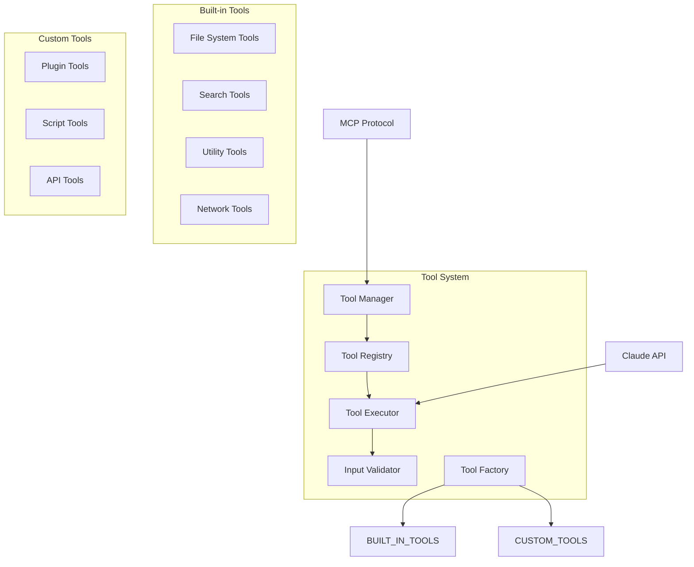

# TelemetryFlow GO MCP Tool System Specification

## Overview

This specification defines the tool system for the TelemetryFlow GO MCP Server, enabling dynamic tool registration, execution, and management through the MCP protocol with Claude API integration.

## Goals

- Provide extensible tool registration and management system
- Enable secure tool execution with proper validation
- Support both built-in and custom tools
- Implement comprehensive tool observability and monitoring
- Ensure tool execution isolation and error handling

## Architecture

### Tool System Components



## Domain Model

### Tool Aggregate

```go
type Tool struct {
    name        vo.ToolName
    description string
    inputSchema JSONSchema
    category    ToolCategory
    enabled     bool
    metadata    ToolMetadata
    executor    ToolExecutor
    createdAt   time.Time
    updatedAt   time.Time
}

type ToolMetadata struct {
    Version     string            `json:"version"`
    Author      string            `json:"author"`
    Tags        []string          `json:"tags"`
    Permissions []Permission      `json:"permissions"`
    Config      map[string]interface{} `json:"config"`
}

type ToolCategory string

const (
    CategoryFileSystem ToolCategory = "filesystem"
    CategorySearch     ToolCategory = "search"
    CategoryUtility    ToolCategory = "utility"
    CategoryNetwork    ToolCategory = "network"
    CategoryCustom     ToolCategory = "custom"
)
```

### Tool Execution Context

```go
type ToolExecutionContext struct {
    SessionID      vo.SessionID
    ConversationID vo.ConversationID
    ToolName       vo.ToolName
    Input          map[string]interface{}
    RequestID      string
    UserContext    UserContext
    Permissions    []Permission
    Timeout        time.Duration
    Environment    map[string]string
}

type ToolExecutionResult struct {
    Content   []ContentBlock
    IsError   bool
    ErrorCode string
    Metadata  map[string]interface{}
    Duration  time.Duration
    Resources []ResourceUsage
}
```

## Tool Registry

### Registry Interface

```go
type IToolRegistry interface {
    Register(ctx context.Context, tool *Tool) error
    Unregister(ctx context.Context, name vo.ToolName) error
    Get(ctx context.Context, name vo.ToolName) (*Tool, error)
    List(ctx context.Context, filter ToolFilter) ([]*Tool, error)
    Update(ctx context.Context, tool *Tool) error
    IsEnabled(ctx context.Context, name vo.ToolName) (bool, error)
    SetEnabled(ctx context.Context, name vo.ToolName, enabled bool) error
}

type ToolFilter struct {
    Category    *ToolCategory
    EnabledOnly bool
    Tags        []string
    Search      string
    Limit       int
    Offset      int
}
```

### Registry Implementation

```go
type ToolRegistry struct {
    tools   map[string]*Tool
    mutex   sync.RWMutex
    storage IToolStorage
    logger  *Logger
    metrics *ToolMetrics
}

func (r *ToolRegistry) Register(ctx context.Context, tool *Tool) error {
    r.mutex.Lock()
    defer r.mutex.Unlock()

    // Validate tool
    if err := r.validateTool(tool); err != nil {
        return fmt.Errorf("invalid tool: %w", err)
    }

    // Check for conflicts
    if existing, exists := r.tools[tool.Name().String()]; exists {
        if existing.Metadata.Version == tool.Metadata.Version {
            return ErrToolAlreadyExists
        }
    }

    // Store tool
    if err := r.storage.Save(ctx, tool); err != nil {
        return fmt.Errorf("failed to save tool: %w", err)
    }

    r.tools[tool.Name().String()] = tool

    // Record metrics
    r.metrics.ToolsRegistered.Inc()

    // Log registration
    r.logger.Info().
        Str("tool_name", tool.Name().String()).
        Str("tool_category", string(tool.Category())).
        Str("tool_version", tool.Metadata.Version).
        Msg("Tool registered successfully")

    return nil
}

func (r *ToolRegistry) List(ctx context.Context, filter ToolFilter) ([]*Tool, error) {
    r.mutex.RLock()
    defer r.mutex.RUnlock()

    var tools []*Tool

    for _, tool := range r.tools {
        if r.matchesFilter(tool, filter) {
            tools = append(tools, tool)
        }
    }

    // Sort tools by name
    sort.Slice(tools, func(i, j int) bool {
        return tools[i].Name().String() < tools[j].Name().String()
    })

    // Apply pagination
    total := len(tools)
    start := filter.Offset
    end := start + filter.Limit

    if start > total {
        return []*Tool{}, nil
    }
    if end > total {
        end = total
    }

    return tools[start:end], nil
}
```

## Tool Execution

### Tool Executor Interface

```go
type IToolExecutor interface {
    Execute(ctx context.Context, execCtx *ToolExecutionContext) (*ToolExecutionResult, error)
    ValidateInput(schema JSONSchema, input map[string]interface{}) error
    GetPermissions() []Permission
    GetTimeout() time.Duration
}

type ToolExecutor interface {
    Execute(ctx context.Context, input map[string]interface{}) (*ToolExecutionResult, error)
}
```

### Execution Engine

```go
type ToolExecutionEngine struct {
    registry    IToolRegistry
    validator   IInputValidator
    sandbox     ISandbox
    monitor     IExecutionMonitor
    logger      *Logger
    metrics     *ToolMetrics
}

func (e *ToolExecutionEngine) ExecuteTool(ctx context.Context, execCtx *ToolExecutionContext) (*ToolExecutionResult, error) {
    // Start execution span
    ctx, span := StartMCPSpan(ctx, "tool.execute",
        attribute.String("tool.name", execCtx.ToolName.String()),
        attribute.String("session.id", execCtx.SessionID.String()),
    )
    defer span.End()

    // Get tool from registry
    tool, err := e.registry.Get(ctx, execCtx.ToolName)
    if err != nil {
        span.RecordError(err)
        return nil, fmt.Errorf("tool not found: %w", err)
    }

    // Check if tool is enabled
    if !tool.IsEnabled() {
        err := ErrToolDisabled
        span.RecordError(err)
        return nil, err
    }

    // Validate input
    if err := e.validator.ValidateInput(tool.InputSchema(), execCtx.Input); err != nil {
        span.RecordError(err)
        return nil, fmt.Errorf("input validation failed: %w", err)
    }

    // Check permissions
    if err := e.checkPermissions(execCtx, tool); err != nil {
        span.RecordError(err)
        return nil, fmt.Errorf("permission denied: %w", err)
    }

    // Execute in sandbox
    result, err := e.executeInSandbox(ctx, tool, execCtx)
    if err != nil {
        span.RecordError(err)
        e.metrics.ToolExecutionErrors.WithLabelValues(execCtx.ToolName.String()).Inc()
        return nil, fmt.Errorf("execution failed: %w", err)
    }

    // Record metrics
    e.metrics.ToolExecutions.WithLabelValues(execCtx.ToolName.String(), "success").Inc()
    e.metrics.ToolExecutionDuration.WithLabelValues(execCtx.ToolName.String()).Observe(result.Duration.Seconds())

    span.SetAttributes(
        attribute.Int("tool.result.size", len(result.Content)),
        attribute.Bool("tool.result.error", result.IsError),
        attribute.Int64("tool.execution.duration_ms", result.Duration.Milliseconds()),
    )

    return result, nil
}

func (e *ToolExecutionEngine) executeInSandbox(ctx context.Context, tool *Tool, execCtx *ToolExecutionContext) (*ToolExecutionResult, error) {
    // Create sandbox environment
    sandbox := e.sandbox.Create(&SandboxConfig{
        Timeout:     execCtx.Timeout,
        Environment: execCtx.Environment,
        Permissions: execCtx.Permissions,
        ResourceLimits: ResourceLimits{
            MaxMemory: 256 * 1024 * 1024, // 256MB
            MaxCPU:    1.0,                // 1 CPU core
            MaxFiles:  100,                // Max 100 file handles
        },
    })
    defer sandbox.Cleanup()

    // Execute tool
    start := time.Now()
    result, err := sandbox.Execute(ctx, tool.Executor(), execCtx.Input)
    duration := time.Since(start)

    if err != nil {
        return &ToolExecutionResult{
            Content:   []ContentBlock{{Type: "text", Text: err.Error()}},
            IsError:   true,
            ErrorCode: "EXECUTION_ERROR",
            Duration:  duration,
        }, nil
    }

    result.Duration = duration
    return result, nil
}
```

## Built-in Tools

### File System Tools

```go
// SearchFilesTool - Search for files using glob patterns
type SearchFilesTool struct {
    baseDir     string
    maxResults  int
    allowedExts []string
}

func (t *SearchFilesTool) Execute(ctx context.Context, input map[string]interface{}) (*ToolExecutionResult, error) {
    pattern, ok := input["pattern"].(string)
    if !ok {
        return nil, ErrInvalidInput
    }

    // Validate pattern for security
    if err := t.validatePattern(pattern); err != nil {
        return nil, fmt.Errorf("invalid pattern: %w", err)
    }

    // Search files
    matches, err := filepath.Glob(filepath.Join(t.baseDir, pattern))
    if err != nil {
        return &ToolExecutionResult{
            Content: []ContentBlock{{Type: "text", Text: err.Error()}},
            IsError: true,
        }, nil
    }

    // Limit results
    if len(matches) > t.maxResults {
        matches = matches[:t.maxResults]
    }

    // Filter by allowed extensions
    var filteredMatches []string
    for _, match := range matches {
        if t.isAllowedExtension(match) {
            filteredMatches = append(filteredMatches, match)
        }
    }

    // Format results
    var content strings.Builder
    content.WriteString(fmt.Sprintf("Found %d files:\n", len(filteredMatches)))
    for _, match := range filteredMatches {
        content.WriteString(fmt.Sprintf("- %s\n", match))
    }

    return &ToolExecutionResult{
        Content: []ContentBlock{{Type: "text", Text: content.String()}},
        IsError: false,
        Metadata: map[string]interface{}{
            "file_count": len(filteredMatches),
            "pattern":    pattern,
        },
    }, nil
}

// ReadFileTool - Read file contents with safety checks
type ReadFileTool struct {
    baseDir     string
    maxFileSize int64
    allowedExts []string
}

func (t *ReadFileTool) Execute(ctx context.Context, input map[string]interface{}) (*ToolExecutionResult, error) {
    filePath, ok := input["path"].(string)
    if !ok {
        return nil, ErrInvalidInput
    }

    // Security validation
    if err := t.validateFilePath(filePath); err != nil {
        return nil, fmt.Errorf("invalid file path: %w", err)
    }

    fullPath := filepath.Join(t.baseDir, filePath)

    // Check file exists and size
    info, err := os.Stat(fullPath)
    if err != nil {
        return &ToolExecutionResult{
            Content: []ContentBlock{{Type: "text", Text: fmt.Sprintf("File not found: %s", filePath)}},
            IsError: true,
        }, nil
    }

    if info.Size() > t.maxFileSize {
        return &ToolExecutionResult{
            Content: []ContentBlock{{Type: "text", Text: fmt.Sprintf("File too large: %d bytes (max: %d)", info.Size(), t.maxFileSize)}},
            IsError: true,
        }, nil
    }

    // Read file
    content, err := os.ReadFile(fullPath)
    if err != nil {
        return &ToolExecutionResult{
            Content: []ContentBlock{{Type: "text", Text: err.Error()}},
            IsError: true,
        }, nil
    }

    return &ToolExecutionResult{
        Content: []ContentBlock{{Type: "text", Text: string(content)}},
        IsError: false,
        Metadata: map[string]interface{}{
            "file_path": filePath,
            "file_size": info.Size(),
            "mime_type": t.detectMimeType(fullPath),
        },
    }, nil
}
```

### Search Tools

```go
// GrepTool - Search text within files
type GrepTool struct {
    baseDir    string
    maxResults int
    maxFiles   int
}

func (t *GrepTool) Execute(ctx context.Context, input map[string]interface{}) (*ToolExecutionResult, error) {
    pattern, ok := input["pattern"].(string)
    if !ok {
        return nil, ErrInvalidInput
    }

    filePattern := input["file_pattern"].(string)
    if filePattern == "" {
        filePattern = "*"
    }

    caseSensitive := input["case_sensitive"].(bool)

    // Compile regex
    var regex *regexp.Regexp
    var err error
    if caseSensitive {
        regex, err = regexp.Compile(pattern)
    } else {
        regex, err = regexp.Compile("(?i)" + pattern)
    }
    if err != nil {
        return &ToolExecutionResult{
            Content: []ContentBlock{{Type: "text", Text: fmt.Sprintf("Invalid regex pattern: %s", err.Error())}},
            IsError: true,
        }, nil
    }

    // Find files to search
    files, err := filepath.Glob(filepath.Join(t.baseDir, filePattern))
    if err != nil {
        return &ToolExecutionResult{
            Content: []ContentBlock{{Type: "text", Text: err.Error()}},
            IsError: true,
        }, nil
    }

    // Limit files to search
    if len(files) > t.maxFiles {
        files = files[:t.maxFiles]
    }

    // Search in files
    var results []SearchResult
    for _, file := range files {
        matches, err := t.searchInFile(file, regex)
        if err != nil {
            continue // Skip files that can't be read
        }
        results = append(results, matches...)

        if len(results) >= t.maxResults {
            break
        }
    }

    // Format results
    var content strings.Builder
    content.WriteString(fmt.Sprintf("Found %d matches:\n", len(results)))
    for _, result := range results {
        content.WriteString(fmt.Sprintf("%s:%d: %s\n", result.File, result.Line, result.Text))
    }

    return &ToolExecutionResult{
        Content: []ContentBlock{{Type: "text", Text: content.String()}},
        IsError: false,
        Metadata: map[string]interface{}{
            "match_count": len(results),
            "files_searched": len(files),
            "pattern": pattern,
        },
    }, nil
}
```

### Utility Tools

```go
// Base64Tool - Encode/decode base64
type Base64Tool struct{}

func (t *Base64Tool) Execute(ctx context.Context, input map[string]interface{}) (*ToolExecutionResult, error) {
    operation, ok := input["operation"].(string)
    if !ok {
        return nil, ErrInvalidInput
    }

    text, ok := input["text"].(string)
    if !ok {
        return nil, ErrInvalidInput
    }

    var result string
    var err error

    switch operation {
    case "encode":
        result = base64.StdEncoding.EncodeToString([]byte(text))
    case "decode":
        decoded, decodeErr := base64.StdEncoding.DecodeString(text)
        if decodeErr != nil {
            return &ToolExecutionResult{
                Content: []ContentBlock{{Type: "text", Text: fmt.Sprintf("Decode error: %s", decodeErr.Error())}},
                IsError: true,
            }, nil
        }
        result = string(decoded)
    default:
        return &ToolExecutionResult{
            Content: []ContentBlock{{Type: "text", Text: "Invalid operation. Use 'encode' or 'decode'"}},
            IsError: true,
        }, nil
    }

    return &ToolExecutionResult{
        Content: []ContentBlock{{Type: "text", Text: result}},
        IsError: false,
        Metadata: map[string]interface{}{
            "operation": operation,
            "input_length": len(text),
            "output_length": len(result),
        },
    }, nil
}

// HashTool - Generate various hashes
type HashTool struct{}

func (t *HashTool) Execute(ctx context.Context, input map[string]interface{}) (*ToolExecutionResult, error) {
    algorithm, ok := input["algorithm"].(string)
    if !ok {
        return nil, ErrInvalidInput
    }

    text, ok := input["text"].(string)
    if !ok {
        return nil, ErrInvalidInput
    }

    var hash string
    var err error

    switch strings.ToLower(algorithm) {
    case "md5":
        h := md5.Sum([]byte(text))
        hash = hex.EncodeToString(h[:])
    case "sha1":
        h := sha1.Sum([]byte(text))
        hash = hex.EncodeToString(h[:])
    case "sha256":
        h := sha256.Sum256([]byte(text))
        hash = hex.EncodeToString(h[:])
    case "sha512":
        h := sha512.Sum512([]byte(text))
        hash = hex.EncodeToString(h[:])
    default:
        return &ToolExecutionResult{
            Content: []ContentBlock{{Type: "text", Text: "Unsupported algorithm. Use: md5, sha1, sha256, sha512"}},
            IsError: true,
        }, nil
    }

    return &ToolExecutionResult{
        Content: []ContentBlock{{Type: "text", Text: hash}},
        IsError: false,
        Metadata: map[string]interface{}{
            "algorithm": algorithm,
            "input_length": len(text),
        },
    }, nil
}
```

## Tool Security

### Sandbox Implementation

```go
type Sandbox struct {
    config      *SandboxConfig
    workDir     string
    environment map[string]string
    limits      ResourceLimits
}

type SandboxConfig struct {
    Timeout        time.Duration
    Environment    map[string]string
    Permissions    []Permission
    ResourceLimits ResourceLimits
}

type ResourceLimits struct {
    MaxMemory int64
    MaxCPU    float64
    MaxFiles  int
    MaxDisk   int64
}

func (s *Sandbox) Execute(ctx context.Context, executor ToolExecutor, input map[string]interface{}) (*ToolExecutionResult, error) {
    // Create execution context with timeout
    execCtx, cancel := context.WithTimeout(ctx, s.config.Timeout)
    defer cancel()

    // Set resource limits
    if err := s.setResourceLimits(); err != nil {
        return nil, fmt.Errorf("failed to set resource limits: %w", err)
    }

    // Execute with monitoring
    resultChan := make(chan *ToolExecutionResult, 1)
    errorChan := make(chan error, 1)

    go func() {
        result, err := executor.Execute(execCtx, input)
        if err != nil {
            errorChan <- err
        } else {
            resultChan <- result
        }
    }()

    select {
    case result := <-resultChan:
        return result, nil
    case err := <-errorChan:
        return nil, err
    case <-execCtx.Done():
        return nil, ErrExecutionTimeout
    }
}
```

### Permission System

```go
type Permission string

const (
    PermissionReadFile    Permission = "file:read"
    PermissionWriteFile   Permission = "file:write"
    PermissionExecute     Permission = "execute"
    PermissionNetwork     Permission = "network"
    PermissionEnvironment Permission = "environment"
)

type PermissionChecker struct {
    policies map[string][]Permission
}

func (pc *PermissionChecker) CheckPermission(userContext UserContext, permission Permission) error {
    userPermissions, exists := pc.policies[userContext.UserID]
    if !exists {
        return ErrPermissionDenied
    }

    for _, p := range userPermissions {
        if p == permission {
            return nil
        }
    }

    return ErrPermissionDenied
}
```

## Tool Configuration

### Tool Registration Configuration

```yaml
tools:
  built_in:
    filesystem:
      enabled: true
      base_dir: "/workspace"
      max_file_size: "10MB"
      allowed_extensions: [".go", ".md", ".txt", ".json", ".yaml"]

    search:
      enabled: true
      max_results: 100
      max_files: 1000

    utility:
      enabled: true

  custom:
    enabled: true
    plugin_dir: "/plugins"
    script_dir: "/scripts"

  security:
    sandbox:
      enabled: true
      timeout: "30s"
      max_memory: "256MB"
      max_cpu: 1.0
      max_files: 100

    permissions:
      default: ["file:read"]
      admin: ["file:read", "file:write", "execute", "network"]
```

### Tool Schema Definitions

```json
{
  "search_files": {
    "name": "search_files",
    "description": "Search for files using glob patterns",
    "inputSchema": {
      "type": "object",
      "properties": {
        "pattern": {
          "type": "string",
          "description": "Glob pattern to search for files"
        },
        "max_results": {
          "type": "integer",
          "description": "Maximum number of results to return",
          "default": 50
        }
      },
      "required": ["pattern"]
    }
  },
  "read_file": {
    "name": "read_file",
    "description": "Read the contents of a file",
    "inputSchema": {
      "type": "object",
      "properties": {
        "path": {
          "type": "string",
          "description": "Path to the file to read"
        },
        "encoding": {
          "type": "string",
          "description": "File encoding",
          "default": "utf-8"
        }
      },
      "required": ["path"]
    }
  }
}
```

## Testing Requirements

### Tool Testing Framework

```go
type ToolTestSuite struct {
    registry IToolRegistry
    executor IToolExecutor
    testData map[string]interface{}
}

func (ts *ToolTestSuite) TestTool(t *testing.T, toolName string, testCases []ToolTestCase) {
    tool, err := ts.registry.Get(context.Background(), vo.ToolName(toolName))
    require.NoError(t, err)

    for _, tc := range testCases {
        t.Run(tc.Name, func(t *testing.T) {
            ctx := context.Background()
            execCtx := &ToolExecutionContext{
                SessionID:   vo.SessionID("test-session"),
                ToolName:    vo.ToolName(toolName),
                Input:       tc.Input,
                Timeout:     30 * time.Second,
                Permissions: tc.Permissions,
            }

            result, err := ts.executor.ExecuteTool(ctx, execCtx)

            if tc.WantError {
                assert.Error(t, err)
            } else {
                assert.NoError(t, err)
                assert.NotNil(t, result)

                if tc.Validate != nil {
                    tc.Validate(t, result)
                }
            }
        })
    }
}

type ToolTestCase struct {
    Name        string
    Input       map[string]interface{}
    Permissions []Permission
    WantError   bool
    Validate    func(*testing.T, *ToolExecutionResult)
}
```

## Success Criteria

### Functional Requirements

- [ ] Tool registry supporting registration, discovery, and management
- [ ] Secure tool execution with sandboxing and resource limits
- [ ] Built-in tools for file system, search, and utility operations
- [ ] Custom tool support through plugins and scripts
- [ ] Comprehensive input validation and error handling

### Non-Functional Requirements

- [ ] Tool execution latency <500ms for P95
- [ ] Support for ≥50 concurrent tool executions
- [ ] Memory usage <256MB per tool execution
- [ ] Comprehensive tool execution observability
- [ ] Zero security vulnerabilities in tool execution

### Quality Gates

- [ ] All tool tests passing with ≥90% coverage
- [ ] Security audit passing for sandbox implementation
- [ ] Performance benchmarks meeting requirements
- [ ] Tool documentation complete and accurate
- [ ] Integration tests with Claude API passing
