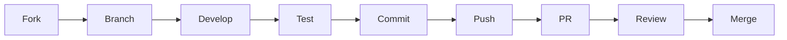

# Contributing to TelemetryFlow GO MCP

Thank you for your interest in contributing to TelemetryFlow GO MCP Server! This document provides guidelines and information for contributors.

## Table of Contents

- [Code of Conduct](#code-of-conduct)
- [Getting Started](#getting-started)
- [Development Setup](#development-setup)
- [How to Contribute](#how-to-contribute)
- [Pull Request Process](#pull-request-process)
- [Coding Standards](#coding-standards)
- [Testing Guidelines](#testing-guidelines)
- [Documentation](#documentation)
- [Community](#community)

---

## Code of Conduct

This project adheres to the [Contributor Covenant Code of Conduct](https://www.contributor-covenant.org/version/2/1/code_of_conduct/). By participating, you are expected to uphold this code. Please report unacceptable behavior to the project maintainers.

### Our Standards

- Be respectful and inclusive
- Welcome newcomers and help them learn
- Focus on constructive feedback
- Accept responsibility for mistakes
- Prioritize the community's best interests

---

## Getting Started

### Prerequisites

- Go 1.24 or higher
- Git
- Make
- Docker (optional, for containerized development)

### Quick Start

```bash
# Fork and clone the repository
git clone https://github.com/YOUR_USERNAME/telemetryflow.git
cd telemetryflow/telemetryflow-mcp

# Run development setup
./scripts/setup-dev.sh

# Create a branch for your changes
git checkout -b feature/your-feature-name

# Make your changes and test
make test

# Submit a pull request
```

---

## Development Setup

### Automated Setup

```bash
# Run the development setup script
./scripts/setup-dev.sh
```

This script will:

- Install Go development tools (golangci-lint, goimports, etc.)
- Download dependencies
- Set up Git hooks
- Create local configuration files
- Configure VS Code (if using)

### Manual Setup

```bash
# Install dependencies
go mod download

# Install development tools
go install github.com/golangci/golangci-lint/cmd/golangci-lint@latest
go install golang.org/x/tools/cmd/goimports@latest
go install go.uber.org/mock/mockgen@latest

# Set up Git hooks
cp scripts/githooks/* .git/hooks/
chmod +x .git/hooks/*

# Create local configuration
cp .env.example .env
# Edit .env with your API keys
```

### Environment Variables

```bash
# Required for full functionality
export TELEMETRYFLOW_MCP_CLAUDE_API_KEY="your-api-key"

# Optional
export TELEMETRYFLOW_MCP_LOG_LEVEL="debug"
export TELEMETRYFLOW_MCP_TELEMETRY_ENABLED="false"
```

---

## How to Contribute

### Types of Contributions

We welcome many types of contributions:

| Type             | Description                      |
| ---------------- | -------------------------------- |
| Bug Reports      | Report issues and bugs           |
| Feature Requests | Suggest new features             |
| Bug Fixes        | Fix existing issues              |
| New Features     | Implement new functionality      |
| Documentation    | Improve docs, examples, comments |
| Tests            | Add or improve tests             |
| Performance      | Optimize code performance        |
| Refactoring      | Improve code quality             |

### Reporting Bugs

Before reporting a bug:

1. Check existing issues to avoid duplicates
2. Use the latest version
3. Collect relevant information

**Bug Report Template:**

```markdown
## Description

Brief description of the bug.

## Steps to Reproduce

1. Step one
2. Step two
3. Step three

## Expected Behavior

What should happen.

## Actual Behavior

What actually happens.

## Environment

- TFO-MCP Version:
- OS:
- Go Version:

## Logs
```

Paste relevant logs here

```

## Additional Context
Any other relevant information.
```

### Suggesting Features

**Feature Request Template:**

```markdown
## Problem Statement

Describe the problem this feature would solve.

## Proposed Solution

Describe your proposed solution.

## Alternatives Considered

What alternatives have you considered?

## Use Cases

How would this feature be used?

## Additional Context

Any other relevant information.
```

---

## Pull Request Process

### Workflow



### Step-by-Step

1. **Fork the repository**

   ```bash
   # Fork on GitHub, then clone your fork
   git clone https://github.com/YOUR_USERNAME/telemetryflow.git
   cd telemetryflow/telemetryflow-mcp
   ```

2. **Create a feature branch**

   ```bash
   git checkout -b feature/your-feature-name
   # or
   git checkout -b fix/bug-description
   ```

3. **Make your changes**

   - Follow coding standards
   - Add tests for new functionality
   - Update documentation as needed

4. **Test your changes**

   ```bash
   make test          # Run tests
   make lint          # Run linter
   make fmt           # Format code
   ```

5. **Commit with conventional commits**

   ```bash
   git commit -m "feat(tools): add new search tool"
   ```

6. **Push and create PR**
   ```bash
   git push origin feature/your-feature-name
   # Create PR on GitHub
   ```

### Commit Message Format

We use [Conventional Commits](https://www.conventionalcommits.org/):

```
<type>(<scope>): <subject>

[optional body]

[optional footer]
```

**Types:**

- `feat`: New feature
- `fix`: Bug fix
- `docs`: Documentation
- `style`: Formatting (no code change)
- `refactor`: Code restructuring
- `test`: Tests
- `chore`: Maintenance
- `perf`: Performance improvement
- `ci`: CI/CD changes

**Examples:**

```
feat(tools): add file search tool with regex support

Implements a new search_files tool that supports both glob
and regex patterns for searching files.

Closes #123
```

```
fix(session): handle timeout correctly

Session timeout was not being reset after successful requests.
```

### Pull Request Template

```markdown
## Description

Brief description of changes.

## Type of Change

- [ ] Bug fix (non-breaking change fixing an issue)
- [ ] New feature (non-breaking change adding functionality)
- [ ] Breaking change (fix or feature causing existing functionality to change)
- [ ] Documentation update

## Related Issues

Fixes #(issue number)

## Changes Made

- Change 1
- Change 2
- Change 3

## Testing

- [ ] Unit tests added/updated
- [ ] Integration tests added/updated
- [ ] Manual testing performed

## Checklist

- [ ] My code follows the project's style guidelines
- [ ] I have performed a self-review
- [ ] I have commented hard-to-understand code
- [ ] I have updated the documentation
- [ ] My changes generate no new warnings
- [ ] I have added tests proving my fix/feature works
- [ ] All tests pass locally
```

---

## Coding Standards

### Go Style Guide

Follow the official [Go Code Review Comments](https://github.com/golang/go/wiki/CodeReviewComments) and [Effective Go](https://golang.org/doc/effective_go).

### Naming Conventions

| Type             | Convention               | Example              |
| ---------------- | ------------------------ | -------------------- |
| Package          | lowercase                | `valueobjects`       |
| Interface        | PascalCase with I prefix | `ISessionRepository` |
| Struct           | PascalCase               | `SessionHandler`     |
| Public Function  | PascalCase               | `HandleRequest`      |
| Private Function | camelCase                | `parseInput`         |
| Variable         | camelCase                | `sessionID`          |
| Constant         | PascalCase               | `MaxRetries`         |
| Error            | Err prefix               | `ErrSessionNotFound` |

### File Organization

```go
// Package documentation
package example

// Imports (grouped: std lib, third-party, internal)
import (
    "context"

    "github.com/google/uuid"

    "github.com/telemetryflow/telemetryflow-mcp/internal/domain"
)

// Constants
const (
    MaxRetries = 3
)

// Errors
var (
    ErrNotFound = errors.New("not found")
)

// Types (interfaces first)
type Handler interface {
    Handle(ctx context.Context) error
}

type service struct {
    repo Repository
}

// Constructor
func NewService(repo Repository) *service {
    return &service{repo: repo}
}

// Methods
func (s *service) Process(ctx context.Context) error {
    // ...
}
```

### Error Handling

```go
// Define domain errors
var ErrSessionNotFound = errors.New("session not found")

// Wrap errors with context
func (s *service) GetSession(ctx context.Context, id string) (*Session, error) {
    session, err := s.repo.FindByID(ctx, id)
    if err != nil {
        return nil, fmt.Errorf("get session %s: %w", id, err)
    }
    return session, nil
}

// Check specific errors
if errors.Is(err, ErrSessionNotFound) {
    // Handle not found
}
```

---

## Testing Guidelines

### Test Requirements

- All new code must have tests
- Maintain minimum 80% coverage
- Write both unit and integration tests

### Test Structure

```go
func TestFunctionName(t *testing.T) {
    // Arrange
    input := "test"
    expected := "result"

    // Act
    result := FunctionName(input)

    // Assert
    if result != expected {
        t.Errorf("FunctionName(%q) = %q, want %q", input, result, expected)
    }
}
```

### Table-Driven Tests

```go
func TestNewSessionID(t *testing.T) {
    tests := []struct {
        name    string
        input   string
        wantErr bool
    }{
        {"valid uuid", "123e4567-e89b-12d3-a456-426614174000", false},
        {"invalid uuid", "invalid", true},
        {"empty", "", true},
    }

    for _, tt := range tests {
        t.Run(tt.name, func(t *testing.T) {
            _, err := NewSessionID(tt.input)
            if (err != nil) != tt.wantErr {
                t.Errorf("NewSessionID() error = %v, wantErr %v", err, tt.wantErr)
            }
        })
    }
}
```

### Running Tests

```bash
# Run all tests
make test

# Run with coverage
make test-cover

# Run specific package
go test -v ./internal/domain/valueobjects/...

# Run with race detector
go test -race ./...
```

---

## Documentation

### What to Document

- All public APIs
- Complex internal logic
- Configuration options
- Usage examples

### Documentation Format

```go
// SessionID represents a unique session identifier.
// It wraps a UUID string and provides validation.
type SessionID struct {
    value string
}

// NewSessionID creates a new SessionID from a string.
// Returns an error if the string is not a valid UUID.
//
// Example:
//
//     id, err := NewSessionID("123e4567-e89b-12d3-a456-426614174000")
//     if err != nil {
//         return err
//     }
func NewSessionID(value string) (SessionID, error) {
    // ...
}
```

### Updating Documentation

When making changes:

1. Update code comments
2. Update relevant markdown files in `docs/`
3. Update README if needed
4. Update CHANGELOG

---

## Community

### Getting Help

- **Documentation**: [docs/README.md](docs/README.md)
- **Issues**: [GitHub Issues](https://github.com/telemetryflow/telemetryflow-mcp/issues)
- **Discussions**: [GitHub Discussions](https://github.com/telemetryflow/telemetryflow-mcp/discussions)

### Recognition

Contributors will be recognized in:

- CONTRIBUTORS.md file
- Release notes
- Project documentation

---

## License

By contributing to TelemetryFlow GO MCP, you agree that your contributions will be licensed under the Apache License 2.0.

---

Thank you for contributing to TelemetryFlow GO MCP!
