<div align="center">
  <picture>
    <source media="(prefers-color-scheme: dark)" srcset="https://github.com/telemetryflow/.github/raw/main/docs/assets/tfo-logo-mcp-dark.svg">
    <source media="(prefers-color-scheme: light)" srcset="https://github.com/telemetryflow/.github/raw/main/docs/assets/tfo-logo-mcp-light.svg">
    
  </picture>

  <h3>TelemetryFlow GO MCP Server (TFO-GO-MCP)</h3>

[](CHANGELOG.md)
[](https://opensource.org/licenses/Apache-2.0)
[](https://golang.org/)
[](https://modelcontextprotocol.io/)
[](https://anthropic.com)
[](https://opentelemetry.io/)
[](docs/ARCHITECTURE.md)
[](https://www.postgresql.org/)
[](https://clickhouse.com/)

</div>

---

**Enterprise-Grade Model Context Protocol Server with Claude AI Integration**

A comprehensive MCP server implementation built using Go and following Domain-Driven Design (DDD) patterns, providing seamless integration between the Model Context Protocol and Anthropic's Claude AI.

This server works as the **AI integration layer** for the TelemetryFlow Platform, providing:

- Claude AI conversation capabilities via MCP
- Tool execution with built-in and custom tools
- Resource management and prompt templates
- TelemetryFlow SDK observability integration

---

## TelemetryFlow Ecosystem


| Component      | Version    | OTEL Base          | Role                          |
| -------------- | ---------- | ------------------ | ----------------------------- |
| TFO-Core       | v1.1.4     | -                  | Identity & Access Management  |
| TFO-Agent      | v1.1.2     | SDK v1.39.0        | Telemetry Collection Agent    |
| TFO-Collector  | v1.1.2     | Collector v0.142.0 | Central Telemetry Processing  |
| TFO-Go-SDK     | v1.1.2     | SDK v1.39.0        | Go Instrumentation            |
| TFO-Python-SDK | v1.1.2     | SDK v1.28.0        | Python Instrumentation        |
| **TFO-Go-MCP** | **v1.1.2** | **SDK v1.39.0**    | **GO MCP Server + Claude AI** |
| TFO-Python-MCP | v1.1.2     | SDK v1.28.0        | Python MCP Server + Claude AI |

---

## Quick Facts

| Property             | Value                                                   |
| -------------------- | ------------------------------------------------------- |
| **Version**          | 1.1.2                                                   |
| **Language**         | Go 1.24+                                                |
| **MCP Protocol**     | 2024-11-05                                              |
| **Claude SDK**       | anthropic-sdk-go v0.2.0-beta.3                          |
| **OTEL SDK**         | v1.39.0                                                 |
| **Architecture**     | DDD/CQRS                                                |
| **Transport**        | stdio, SSE (planned), WebSocket (planned)               |
| **Built-in Tools**   | 8 tools                                                 |
| **Supported Models** | Claude 4 Opus, Claude 4 Sonnet, Claude 3.5 Sonnet/Haiku |
| **Databases**        | PostgreSQL (GORM), ClickHouse, Redis (Cache)            |
| **Queue**            | NATS JetStream                                          |

---

## System Architecture


---

## MCP Protocol Data Flow


---

## Domain-Driven Design Architecture

```mermaid
graph TB
    subgraph "Domain Layer"
        subgraph "Aggregates"
            SESSION[Session Aggregate<br/>├─ ID, State, Capabilities<br/>├─ Tools, Resources, Prompts<br/>└─ Conversations]
            CONV[Conversation Aggregate<br/>├─ ID, Model, Status<br/>├─ Messages, Tools<br/>└─ Settings]
        end

        subgraph "Entities"
            MSG[Message<br/>├─ ID, Role, Content<br/>└─ Metadata]
            TOOL[Tool<br/>├─ Name, Description<br/>├─ InputSchema<br/>└─ Handler]
            RES[Resource<br/>├─ URI, Name, MimeType<br/>└─ Reader]
            PROMPT[Prompt<br/>├─ Name, Arguments<br/>└─ Generator]
        end

        subgraph "Value Objects"
            IDS[Identifiers<br/>SessionID, ConversationID<br/>MessageID, ToolID]
            CONTENT[Content Types<br/>TextContent, Role<br/>Model, MimeType]
            MCP_VO[MCP Types<br/>Method, Capability<br/>LogLevel, ErrorCode]
        end

        subgraph "Domain Events"
            SESS_EVT[Session Events<br/>Created, Initialized<br/>Closed]
            CONV_EVT[Conversation Events<br/>Created, MessageAdded<br/>Closed]
            TOOL_EVT[Tool Events<br/>Registered, Executed]
        end
    end

    SESSION --> CONV
    CONV --> MSG
    SESSION --> TOOL
    SESSION --> RES
    SESSION --> PROMPT

    SESSION --> IDS
    CONV --> IDS
    MSG --> CONTENT
    TOOL --> MCP_VO

    SESSION --> SESS_EVT
    CONV --> CONV_EVT
    TOOL --> TOOL_EVT

    style SESSION fill:#C8E6C9,stroke:#388E3C,stroke-width:2px
    style CONV fill:#C8E6C9,stroke:#388E3C,stroke-width:2px
    style MSG fill:#BBDEFB,stroke:#1976D2
    style TOOL fill:#BBDEFB,stroke:#1976D2
    style IDS fill:#FFF9C4,stroke:#F9A825
    style CONTENT fill:#FFF9C4,stroke:#F9A825
```



---

## CQRS Pattern Implementation


---

## Built-in Tools Architecture


### Tool Reference

| Tool                  | Category | Description                | Key Parameters                      |
| --------------------- | -------- | -------------------------- | ----------------------------------- |
| `claude_conversation` | AI       | Send messages to Claude AI | `message`, `model`, `system_prompt` |
| `read_file`           | File     | Read file contents         | `path`, `encoding`                  |
| `write_file`          | File     | Write content to file      | `path`, `content`, `create_dirs`    |
| `list_directory`      | File     | List directory contents    | `path`, `recursive`                 |
| `search_files`        | File     | Search files by pattern    | `path`, `pattern`                   |
| `execute_command`     | System   | Execute shell commands     | `command`, `working_dir`, `timeout` |
| `system_info`         | System   | Get system information     | -                                   |
| `echo`                | Utility  | Echo input (testing)       | `message`                           |

---

## Claude AI Integration


### Supported Models

| Model             | ID                           | Use Case                       |
| ----------------- | ---------------------------- | ------------------------------ |
| Claude 4 Opus     | `claude-opus-4-20250514`     | Complex reasoning, analysis    |
| Claude 4 Sonnet   | `claude-sonnet-4-20250514`   | Balanced performance (default) |
| Claude 3.7 Sonnet | `claude-3-7-sonnet-20250219` | Extended thinking              |
| Claude 3.5 Sonnet | `claude-3-5-sonnet-20241022` | Fast, capable                  |
| Claude 3.5 Haiku  | `claude-3-5-haiku-20241022`  | Quick responses                |

---

## Session Lifecycle


---

## Configuration Architecture


### Environment Variables

| Variable                                 | Description               | Default                    |
| ---------------------------------------- | ------------------------- | -------------------------- |
| `ANTHROPIC_API_KEY`                      | Claude API key (required) | -                          |
| `TELEMETRYFLOW_MCP_SERVER_TRANSPORT`     | Transport type            | `stdio`                    |
| `TELEMETRYFLOW_MCP_SERVER_PORT`          | Server port (SSE/WS)      | `8080`                     |
| `TELEMETRYFLOW_MCP_LOG_LEVEL`            | Log level                 | `info`                     |
| `TELEMETRYFLOW_MCP_LOG_FORMAT`           | Log format                | `json`                     |
| `TELEMETRYFLOW_MCP_DEBUG`                | Debug mode                | `false`                    |
| `TELEMETRYFLOW_MCP_CLAUDE_DEFAULT_MODEL` | Default Claude model      | `claude-sonnet-4-20250514` |
| `TELEMETRYFLOW_MCP_OTLP_ENDPOINT`        | OTEL collector endpoint   | `localhost:4317`           |

---

## Installation

### Prerequisites

- Go 1.24 or later
- Anthropic API key

### From Source

```bash
# Clone the repository
git clone https://github.com/telemetryflow/telemetryflow-go-mcp.git
cd telemetryflow/telemetryflow-go-mcp

# Download dependencies
make deps

# Build
make build

# Install to GOPATH/bin
make install
```

### Using Go Install

```bash
go install github.com/telemetryflow/telemetryflow-go-mcp/cmd/mcp@latest
```

### Docker

```bash
# Build image
docker build -t telemetryflow-go-mcp:1.1.2 .

# Run container
docker run --rm -it \
  -e ANTHROPIC_API_KEY="your-api-key" \
  telemetryflow-go-mcp:1.1.2
```

---

## Configuration

### Configuration File

Create `tfo-mcp.yaml` or use `configs/tfo-mcp.yaml`:

```yaml
# =============================================================================
# TelemetryFlow GO MCP Server Configuration
# Version: 1.1.2
# =============================================================================

server:
  name: "TelemetryFlow-MCP"
  version: "1.1.2"
  transport: "stdio" # stdio, sse, websocket
  debug: false

claude:
  # api_key: Set via ANTHROPIC_API_KEY env var
  default_model: "claude-sonnet-4-20250514"
  max_tokens: 4096
  temperature: 1.0
  timeout: "120s"
  max_retries: 3

mcp:
  protocol_version: "2024-11-05"
  enable_tools: true
  enable_resources: true
  enable_prompts: true
  enable_logging: true
  tool_timeout: "30s"

logging:
  level: "info" # debug, info, warn, error
  format: "json" # json, text
  output: "stderr"

telemetry:
  enabled: true
  service_name: "telemetryflow-go-mcp"
  otlp_endpoint: "localhost:4317"
  trace_sample_rate: 1.0
```

---

## Usage

### Running the Server

```bash
# Run with default config
tfo-mcp

# Run with custom config
tfo-mcp --config /path/to/config.yaml

# Run in debug mode
tfo-mcp --debug

# Show version
tfo-mcp version

# Validate configuration
tfo-mcp validate
```

### Integration with Claude Code

Add to your Claude Code MCP settings (`~/.config/claude-code/mcp_settings.json`):

```json
{
  "mcpServers": {
    "telemetryflow": {
      "command": "tfo-mcp",
      "args": [],
      "env": {
        "ANTHROPIC_API_KEY": "your-api-key"
      }
    }
  }
}
```

### MCP Protocol Examples

#### Initialize Session

```json
{
  "jsonrpc": "2.0",
  "id": 1,
  "method": "initialize",
  "params": {
    "protocolVersion": "2024-11-05",
    "capabilities": {},
    "clientInfo": {
      "name": "my-client",
      "version": "1.0.0"
    }
  }
}
```

#### Response

```json
{
  "jsonrpc": "2.0",
  "id": 1,
  "result": {
    "protocolVersion": "2024-11-05",
    "serverInfo": {
      "name": "TelemetryFlow-MCP",
      "version": "1.1.2"
    },
    "capabilities": {
      "tools": { "listChanged": true },
      "resources": { "subscribe": true, "listChanged": true },
      "prompts": { "listChanged": true },
      "logging": {}
    }
  }
}
```

#### Call Claude Conversation Tool

```json
{
  "jsonrpc": "2.0",
  "id": 3,
  "method": "tools/call",
  "params": {
    "name": "claude_conversation",
    "arguments": {
      "message": "Explain the MCP protocol in simple terms",
      "model": "claude-sonnet-4-20250514",
      "max_tokens": 1024
    }
  }
}
```

---

## Project Structure

```
telemetryflow-go-mcp/
├── cmd/
│   └── mcp/
│       └── main.go                     # Application entry point
├── internal/
│   ├── domain/                         # Domain Layer (DDD)
│   │   ├── aggregates/                 # Session, Conversation aggregates
│   │   │   ├── session.go
│   │   │   └── conversation.go
│   │   ├── entities/                   # Message, Tool, Resource, Prompt
│   │   │   ├── message.go
│   │   │   ├── tool.go
│   │   │   ├── resource.go
│   │   │   └── prompt.go
│   │   ├── valueobjects/               # Immutable value objects
│   │   │   ├── identifiers.go
│   │   │   ├── content.go
│   │   │   └── mcp.go
│   │   ├── events/                     # Domain events
│   │   │   └── events.go
│   │   ├── repositories/               # Repository interfaces
│   │   │   └── repositories.go
│   │   └── services/                   # Domain service interfaces
│   │       └── claude_service.go
│   ├── application/                    # Application Layer (CQRS)
│   │   ├── commands/                   # Write operations
│   │   │   └── commands.go
│   │   ├── queries/                    # Read operations
│   │   │   └── queries.go
│   │   └── handlers/                   # Command/Query handlers
│   │       ├── session_handler.go
│   │       ├── tool_handler.go
│   │       └── conversation_handler.go
│   ├── infrastructure/                 # Infrastructure Layer
│   │   ├── claude/                     # Claude API client
│   │   │   └── client.go
│   │   ├── config/                     # Configuration management
│   │   │   └── config.go
│   │   ├── cache/                      # Redis cache implementation
│   │   │   └── redis.go
│   │   ├── queue/                      # NATS JetStream queue
│   │   │   ├── nats.go
│   │   │   └── tasks.go
│   │   └── persistence/                # Repository implementations
│   │       ├── memory_repositories.go
│   │       ├── clickhouse.go           # ClickHouse analytics
│   │       ├── analytics_repository.go # Analytics queries
│   │       ├── migrator.go             # Database migrations
│   │       ├── seeder.go               # Database seeding
│   │       └── models/                 # GORM models
│   │           └── models.go
│   └── presentation/                   # Presentation Layer
│       ├── server/                     # MCP server implementation
│       │   └── server.go
│       └── tools/                      # Built-in tools
│           └── builtin_tools.go
├── migrations/                         # Database migrations
│   ├── postgres/                       # PostgreSQL migrations
│   │   ├── 000001_init_schema.up.sql
│   │   └── 000001_init_schema.down.sql
│   └── clickhouse/                     # ClickHouse migrations
│       ├── 000001_init_analytics.up.sql
│       └── 000001_init_analytics.down.sql
├── scripts/                            # Initialization scripts
│   ├── init-db.sql                     # PostgreSQL Docker init
│   └── init-clickhouse.sql             # ClickHouse Docker init
├── tests/                              # Test suites
│   ├── unit/                           # Unit tests
│   │   ├── domain/
│   │   ├── application/
│   │   ├── infrastructure/
│   │   └── presentation/
│   └── integration/                    # Integration tests
├── configs/
│   └── config.yaml                     # Default configuration
├── docs/                               # Documentation
│   ├── README.md
│   ├── ARCHITECTURE.md
│   ├── CONFIGURATION.md
│   ├── COMMANDS.md
│   ├── ERD.md                          # Entity relationship diagrams
│   └── DEVELOPMENT.md
├── .kiro/                              # Specifications and steering
│   └── steering/
│       ├── tech.md
│       └── development-patterns.md
├── Makefile                            # Build automation
├── Dockerfile                          # Container build
├── docker-compose.yml                  # Local development stack
├── go.mod                              # Go module
├── .env.example                        # Environment template
└── .gitignore
```

---

## Development

### Make Commands

```bash
# Development
make build              # Build binary
make build-release      # Build optimized release binary
make run                # Build and run
make run-debug          # Run in debug mode
make install            # Install to GOPATH/bin
make clean              # Clean build artifacts

# Dependencies
make deps               # Download dependencies
make deps-update        # Update and tidy dependencies
make deps-refresh       # Refresh all dependencies (clean + download)
make deps-vendor        # Vendor dependencies
make deps-check         # Check for vulnerabilities (requires govulncheck)
make deps-graph         # Show dependency graph
make deps-why DEP=...   # Explain why a dependency is needed

# Code Quality
make fmt                # Format code
make vet                # Run go vet
make lint               # Run golangci-lint
make lint-fix           # Auto-fix lint issues

# Testing
make test               # Run tests
make test-cover         # Tests with coverage
make test-bench         # Run benchmarks
make test-short         # Run short tests only
make test-all           # Run all tests (unit, integration, e2e)

# Cross-compilation
make build-all          # Build for all platforms
make build-linux        # Build for Linux
make build-darwin       # Build for macOS
make build-windows      # Build for Windows

# Docker
make docker-build       # Build Docker image
make docker-run         # Run Docker container

# CI/CD
make ci                 # Full CI pipeline
make ci-test            # CI pipeline (format, vet, lint, test)
make release            # Create release artifacts

# CI-Specific (GitHub Actions)
make test-unit-ci       # Unit tests with coverage output
make test-integration-ci # Integration tests with coverage
make test-e2e-ci        # End-to-end tests
make ci-build           # Cross-platform CI build
make deps-verify        # Verify dependencies
make staticcheck        # Run staticcheck
make govulncheck        # Vulnerability scanning
make coverage-report    # Generate merged coverage report
```

### Testing

```bash
# Run all tests
make test

# Run all test types (unit, integration, e2e)
make test-all

# Run tests with coverage
make test-cover

# View coverage report
open build/coverage.html

# Run benchmarks
make test-bench

# Run CI test pipeline (format + vet + lint + test)
make ci-test
```

---

## OpenTelemetry Integration


### Telemetry Configuration

```yaml
telemetry:
  enabled: true
  service_name: "telemetryflow-go-mcp"
  environment: "production"
  otlp_endpoint: "localhost:4317"
  otlp_insecure: false
  trace_sample_rate: 1.0
  metrics_enabled: true
  metrics_interval: "30s"
```

---

## MCP Capabilities Matrix

| Capability              | Status | Description                   |
| ----------------------- | ------ | ----------------------------- |
| `tools`                 | ✅     | Tool listing and execution    |
| `tools.listChanged`     | ✅     | Dynamic tool registration     |
| `resources`             | ✅     | Resource listing and reading  |
| `resources.subscribe`   | ✅     | Resource change subscriptions |
| `resources.listChanged` | ✅     | Dynamic resource registration |
| `prompts`               | ✅     | Prompt templates              |
| `prompts.listChanged`   | ✅     | Dynamic prompt registration   |
| `logging`               | ✅     | Log level management          |
| `sampling`              | 🔜     | LLM sampling (planned)        |

---

## Error Handling


---

## Security Considerations

| Aspect                | Implementation                           |
| --------------------- | ---------------------------------------- |
| **API Key Storage**   | Environment variables only               |
| **Command Execution** | Configurable timeout, sandboxing planned |
| **File Access**       | Path validation, no traversal            |
| **Rate Limiting**     | Configurable per-minute limits           |
| **CORS**              | Configurable for SSE transport           |
| **Input Validation**  | JSON Schema validation for tools         |

---

## Documentation Index

| Document                                           | Description                         |
| -------------------------------------------------- | ----------------------------------- |
| [README.md](README.md)                             | Project overview and quick start    |
| [docs/ARCHITECTURE.md](docs/ARCHITECTURE.md)       | Detailed architecture documentation |
| [docs/CONFIGURATION.md](docs/CONFIGURATION.md)     | Configuration reference             |
| [docs/COMMANDS.md](docs/COMMANDS.md)               | CLI commands reference              |
| [docs/DEVELOPMENT.md](docs/DEVELOPMENT.md)         | Development guide                   |
| [docs/INSTALLATION.md](docs/INSTALLATION.md)       | Installation guide                  |
| [docs/TROUBLESHOOTING.md](docs/TROUBLESHOOTING.md) | Troubleshooting guide               |

---

## Contributing

1. Fork the repository
2. Create a feature branch (`git checkout -b feature/amazing-feature`)
3. Commit your changes (`git commit -m 'Add amazing feature'`)
4. Push to the branch (`git push origin feature/amazing-feature`)
5. Open a Pull Request

### Development Guidelines

- Follow Go best practices and idioms
- Use DDD patterns for domain logic
- Write unit tests for all handlers
- Document public APIs
- Keep commits atomic and well-described

---

## License

This project is licensed under the MIT License - see the [LICENSE](LICENSE) file for details.

---

## Support

- **Documentation**: [TelemetryFlow Docs](https://docs.telemetryflow.id)
- **Issues**: [GitHub Issues](https://github.com/telemetryflow/telemetryflow-go-mcp/issues)
- **Discussions**: [GitHub Discussions](https://github.com/telemetryflow/telemetryflow-go-mcp/discussions)

---

<p align="center">
  <strong>Built with Go and Claude AI integration for the TelemetryFlow Platform</strong>
  <br/>
  <sub>Copyright © 2024-2026 TelemetryFlow. All rights reserved.</sub>
</p>
